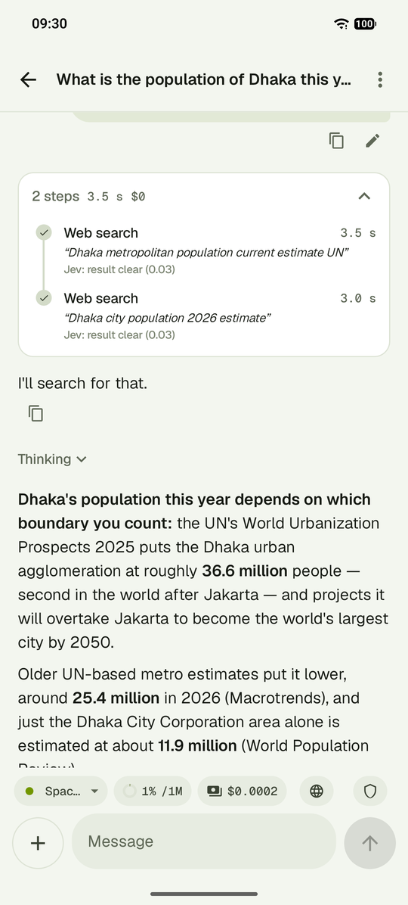
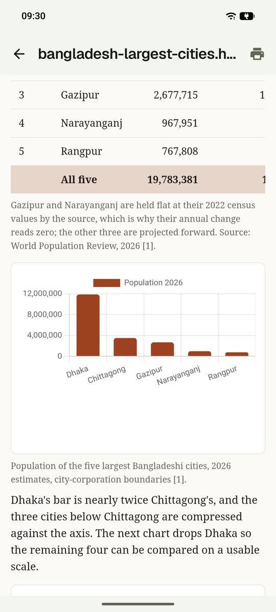
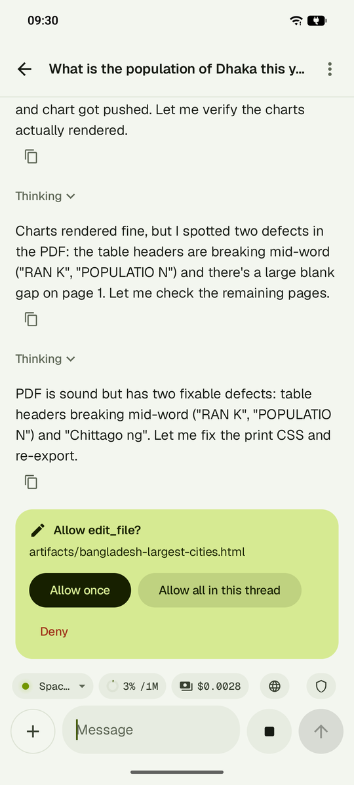

# Jonaki

Jonaki (জোনাকি, Bangla for "firefly") is an AI agent app for Android with a chat interface where you can use your own API keys. The agent searches the web, works with your files, runs code and remembers what matters between conversations. Requests go straight from the phone to the services you set up.

**Download:** [jonaki-v1.4.7.apk](https://github.com/shourovrm/jonaki/releases/download/v1.4.7/jonaki-v1.4.7.apk) · [all releases](https://github.com/shourovrm/jonaki/releases)

<p>
  
  
  
</p>

Jonaki needs Android 8.0 or later on a 64-bit ARM phone. The interface is in English and Bangla.

## Getting started

1. Install the APK. A newer version installs over an older one and keeps your threads.
2. On the first launch, four cards ask for a model key, a web search key, when the agent should ask before a change, and notifications. Each card can be skipped, and Settings has all of it.
3. Start a thread and send a message.

One model key is enough to chat. Some features call a service of their own and stay off until its key is saved:

| Feature | Key it needs |
| --- | --- |
| Web search | Tavily, Serper, Ollama or Exa (any one) |
| YouTube summaries | Gemini |
| Jev guard | OpenRouter |


## Threads

A conversation in Jonaki is a thread, and each thread has its own messages, files, memory and model. A message you send while the agent is working waits in a queue, where you can still edit or cancel it. Each step is saved as it happens, so nothing is lost if Android closes the app in the middle of an answer. When a thread grows long, the older part is summarised for the model while the original messages stay readable.

A project groups related threads and gives them shared files, shared facts and one prompt. Instructions work at three levels: custom instructions apply to every thread, a persona is a saved set of instructions you pick for a thread, and a thread can add its own. The answer style (concise, normal or detailed) is set the same way, for all threads or for one.

An incognito thread uses no memory and is deleted a day after its last message.

## Models and cost

The model and its thinking level are chosen per thread, from any service you have saved a key for:

- **Cloud:** OpenRouter, DeepSeek, Gemini, OpenAI, GLM (Z.ai), Xiaomi MiMo, MiniMax, Qwen and Ollama Cloud
- **Local:** an Ollama server on your network, or GGUF model files that run on the phone itself

Because you pay the services directly, Jonaki shows what each answer cost, with totals per thread and per month. OpenRouter, DeepSeek, MiniMax and Tavily report a balance, and Jonaki shows it on the service's card.

## Tools

**Web.** The agent searches through Tavily, Serper (Google results), Ollama or Exa, trying them in the order you set, and then reads the pages it finds (including with javascripts). It summarises YouTube videos through Gemini, either whole or for a time range. Web access can be turned off for a thread.

**Files.** You give the agent a file by attaching it, sharing it from another app or taking a photo. It reads text, PDF, Word, Excel, PowerPoint and images. What it produces can be saved Downloads, shared to another app, or written to one folder you link.

**Pictures and video.** With an OpenRouter key and an added model, the agent makes pictures, vector images (SVG) and short videos, and can change an existing picture by taking it as a reference. A media button beside the message box sends your words straight to the image or video model, without the chat model, and shows the model and the price before you send.

**Code.** The agent runs JavaScript on the phone. Python is an optional download that runs offline once installed.

**Phone.** The agent creates calendar events, reminders and notifications. A reminder rings again until you tap Done. A scheduled task runs in its thread at the time you set, so the agent can do recurring work without being asked.

**Subagents and MCP.** For a large task the agent hands parts to subagents, each limited by a budget of steps, cost and minutes, and you can define subagent types of your own. Remote MCP servers (services that offer extra tools over the Model Context Protocol) add their tools to the agent.

## Reports, slides and Office files

The agent writes reports and slide decks as HTML pages with charts. They open in an offline viewer, keep every earlier version, and export to PDF with selectable text.

It also writes and edits Word, Excel and PowerPoint files, with native charts in Excel and PowerPoint. These files follow one of three built-in themes or your own `.docx` or `.pptx` template, and an HTML report or deck converts to any of the three formats. Office files need Python and its documents add-on.

## Memory

Jonaki keeps facts at three scopes: one thread, one project, or all threads. The agent saves facts during a chat, and a background model picks up what it missed. Each fact carries its date, so when two facts disagree the newer one wins. Recall matches any word, and the agent can also search earlier chats in other threads.

You stay in charge of what is remembered. Every fact can be read, edited, pinned or deleted, and a fact that was replaced can be restored. Two kinds of fact wait for your approval before they are kept: facts meant for all threads, and facts saved after a thread has read a web page. The whole memory exports as a Markdown file.

## Skills

A skill is a set of instructions for one kind of task, switched on or off per thread. Jonaki ships with skills for reports, slides, Office documents, YouTube summaries and Reddit, and you can import more from a file, a link or a GitHub folder. After a hard task the agent may propose a new skill, which is added only when you approve it.

## Approvals and guardrails

The agent asks before any action that changes a file outside the thread or sends something out of the app. The approval card offers "Allow once" and "Allow all in this thread", and Settings holds "Always allow" rules for single actions. The overall mode is Ask, Auto or Bypass, for all threads or for one.

Text from web pages, documents and other outside sources reaches the model marked as outside content, because such text can carry instructions meant to mislead the agent. After a thread has read outside content, sending data out always asks, whatever the mode. The optional Jev guard skips the card for clearly safe actions and warns when outside text carries instructions.

## Permissions

Settings lists these permissions and shows which ones are granted. The camera is absent because Android's own camera app takes the picture.

| Permission | Used for |
| --- | --- |
| Internet | Requests to the services you set up |
| Notifications | Reminders, notifications the agent sends, and the progress of a run or a model download |
| Calendar (read and write) | Reading and creating events when you ask the agent to |
| Photos | Attaching pictures from the gallery |
| Exact alarms | Ringing reminders and starting scheduled tasks on time |
| Run at startup | Restoring reminders and scheduled tasks after the phone restarts |
| Foreground service | Letting an answer finish while the app is in the background |
| Keep awake | Keeping a run going while the screen is off |

## Code layout

Each swappable part is its own Gradle module, so adding a tool or a model service means adding one module and one line that registers it.

| Folder | Holds |
| --- | --- |
| `app/` | The app itself and the tool registry |
| `core/` | The agent loop, storage and the interfaces the other modules implement |
| `feature/` | One module per screen |
| `tools/` | One module per tool, such as `web-search` or `run-code` |
| `providers/` | Model services, including the on-phone runner built on llama.cpp |
| `search/` | Search backends |
| `runtimes/` | JavaScript and Python |
| `guards/` | The Jev guard |

Dependencies point one way: `app` depends on `feature`, and everything depends on `core`, which depends on none of them. A tool never depends on another tool. `AGENTS.md` has the full rules.

## Building

```
git submodule update --init --depth 1
gradle testReleaseUnitTest assembleRelease
```

The build needs Android SDK platform 35, JDK 17 or later and Gradle 9.7, and it produces release builds only. The APK is signed with `jonaki.keystore` in the repository root, which is not committed; `AGENTS.md` gives the command that creates it.

## Licence

Jonaki is released under the [MIT licence](LICENSE).
